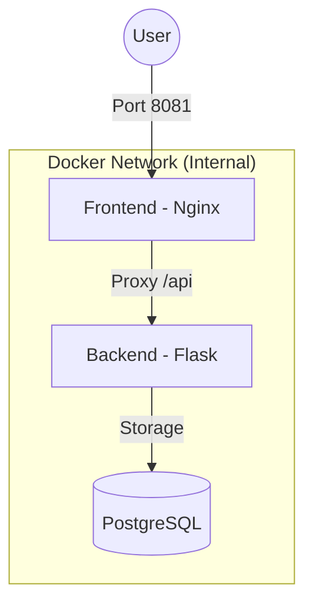

# Capstone Project: Automated CI/CD System
**By: Favour Lawrence**

## 🚀 Project Overview
This repository contains a full-stack **2-tier web application** with a complete, automated CI/CD pipeline. The system handles building, testing, security scanning, and automated deployment to a staging environment using **Docker**, **GitHub Actions**, and **Jenkins**.

---

## 🏗️ Architecture
The application consists of a **Flask API backend** and a **Modern Glassmorphism Frontend**, backed by a **PostgreSQL database**.



---

## 🛠️ Tech Stack
- **Frontend**: HTML5, CSS3 (Glassmorphism), JavaScript
- **Backend**: Python (Flask)
- **Database**: PostgreSQL 15
- **Containerization**: Docker & Docker Compose
- **CI/CD**: GitHub Actions (Primary) & Jenkins (Alternative)
- **Security**: Trivy Vulnerability Scanner

---

## 🚀 How to Run Locally
1. **Clone the repository**:
   ```bash
   git clone <your-repository-url>
   cd capestone
   ```
2. **Start the containers**:
   ```bash
   docker-compose up --build
   ```
3. **Access the App**: Open your browser at [http://localhost:8081](http://localhost:8081)

---

## ⛓️ CI/CD Pipeline (GitHub Actions)
The pipeline is defined in `.github/workflows/main.yml`.

### Pipeline Stages:
1. **Build & Test**: Installs dependencies and runs `pytest` on the backend.
2. **Security**: Scans Docker images for CRITICAL/HIGH vulnerabilities using **Trivy**.
3. **Docker Push**: Pushes optimized multi-stage images to **Docker Hub**.
4. **Deploy**: Triggers a deployment check to ensure the staging environment is healthy.

### Setup (GitHub Secrets):
To enable the pipeline, add these secrets to your GitHub repo:
- `DOCKERHUB_USERNAME`: Your Docker Hub username.
- `DOCKERHUB_TOKEN`: Your Docker Hub Personal Access Token.

---

## 🛡️ Jenkins Integration (Alternative)
A `Jenkinsfile` is provided for users who prefer Jenkins.
- **Guide**: [Jenkins Setup Guide](docs/jenkins_setup.md)
- **Stages**: Checkout → Unit Tests → Build Docker → Security Scan → Push → Deploy.

---

## 📁 Project Structure
- `backend/`: Flask server and Dockerfile.
- `frontend/`: Static assets and Nginx configuration.
- `scripts/`: Deployment and verification shell scripts.
- `docs/`: Deployment runbooks and user guides.

---

## 🎥 Demo & Walkthrough
Detailed recording instructions and success verification steps can be found in the [Demo Guide](docs/demo_guide.md).
